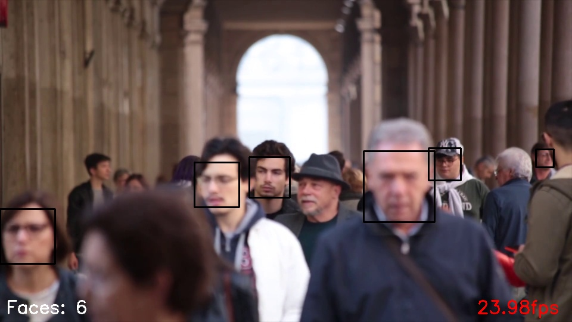

# Face Detection



##  Description
This is a simple face detection program. 
Using OpenCV and a Haar Cascade Classifier, it is able to detect faces in a video stream.
It will save the frame with the most faces in it to a file.

## Video
The video used in the demo is from Pexels, link to file: [https://www.pexels.com/video/video-of-people-walking-855564/](https://www.pexels.com/video/video-of-people-walking-855564/)

##  Setup
1. Install dependencies
    ```bash
	pip3 install -r requirements.txt
	```

2. Run the program

	```bash
	python3 main.py
	```
	
## TODO
- [ ] Add a GUI
- [ ] Add a way to save the frames to a folder
- [ ] Add a way to save the frames to a video
- [ ] Add a way to save the frames to a video with the faces highlighted and the name of the person